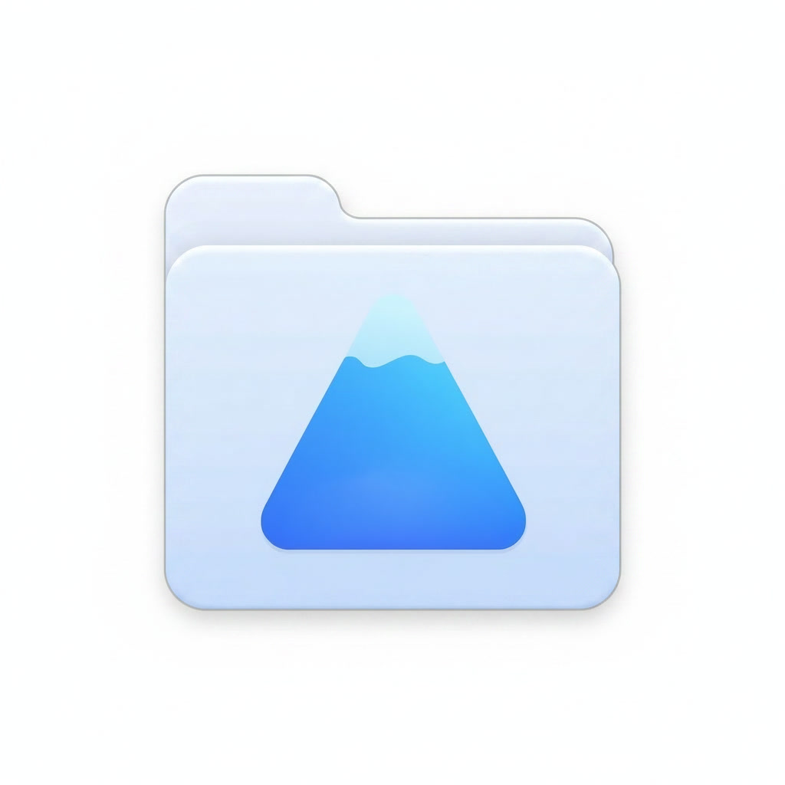
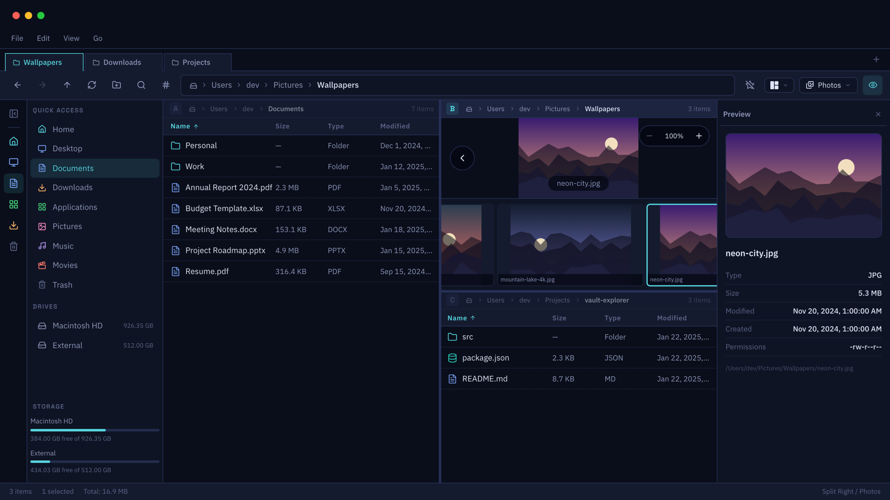
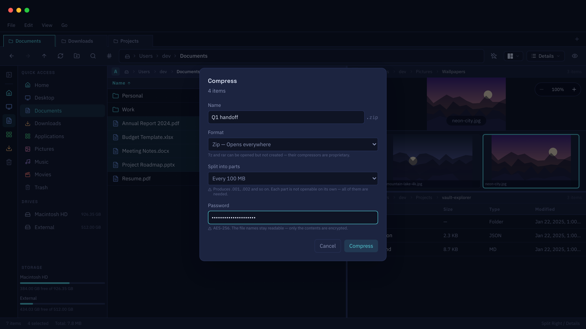
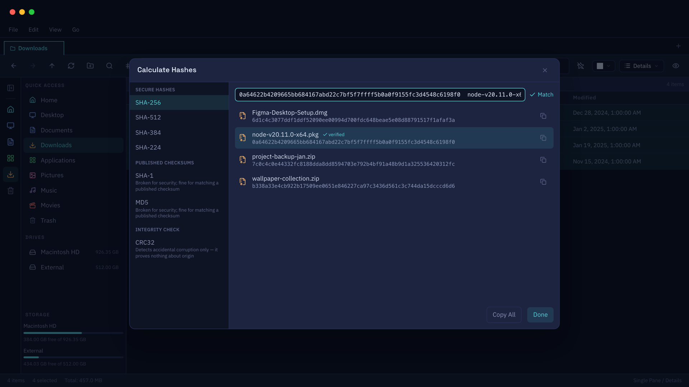
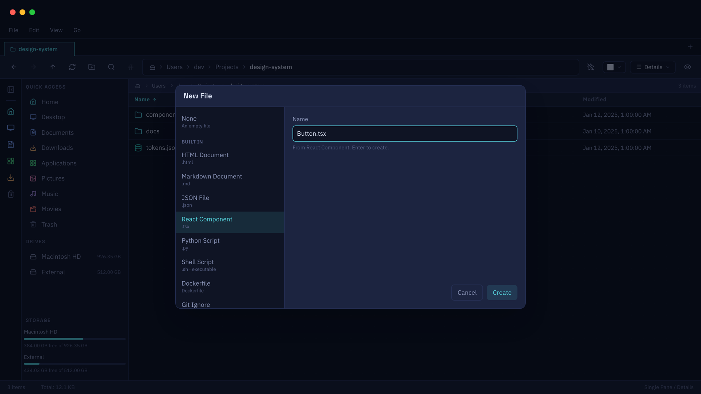

<p align="center">
  
</p>

<h1 align="center">File Base</h1>

<p align="center">
  A fast, native-feeling file explorer for macOS.<br>
  Go + React in one signed binary — no cgo, no bundled helpers, no Electron.
</p>

---

## Screenshots

<table>
  <tr>
    <td width="50%">
      
      <p align="center"><b>🗂️ Browse</b><br>Tabs, places, photo view and a live preview panel.</p>
    </td>
    <td width="50%">
      
            <p align="center"><b>🗜️ Archive</b><br>Open twenty-odd formats, create eight.</p>
    </td>
  </tr>
  <tr>
    <td width="50%">
      
     <p align="center"><b>🔐 Checksums</b><br>Paste a published checksum and it tells you which algorithm it is and whether it matches.</p>
    </td>
    <td width="50%">
      
      <p align="center"><b>💾 New File Templates</b><br>Define and use templates for new files.</p>
    </td>
  </tr>
</table>

---

## Install

Grab the latest zip from [Releases](https://github.com/IvanWasHere/file-base/releases),
unzip it, and drag **file-base.app** to Applications. Universal — Apple silicon
and Intel — and needs macOS 10.13 or later.

> ⚠️ **Builds are not signed yet.** macOS will say the app "is damaged and can't
> be opened", which is a lie about a real thing: the app is intact, it just has
> no Developer ID, and downloads carry a quarantine flag. Right-click it →
> **Open** → **Open**, once, and it will launch from then on. Signing removes
> this entirely — see [docs/RELEASING.md](docs/RELEASING.md).

---

## Features

### 🗂️ Tabs, panes and split layouts

Tabs like a browser, and **nine split arrangements** per tab: single, 2 columns,
2 rows, 3 columns, the four asymmetric ones (one tall pane beside two stacked),
and a 2 × 2 grid. Dividers drag, sizes are remembered, and every pane keeps its
own path, history and selection.

### 👁️ Five ways to look at a folder

Details, large / medium / small icons, and **Photos**. Every list is virtualized,
so a folder with tens of thousands of entries scrolls like an empty one. How you
last viewed a folder is remembered per folder, not globally — Pictures can stay
on icons while Documents stays on details.

### 🔍 Search that knows the difference between here and everywhere

Filtering the **current folder** is instant: it is a predicate over the listing
already on screen, with no round trip. Searching **subfolders** sends the same
criteria to Go, which applies them during the walk and streams results back, with
an SQLite **FTS5** index behind it. Filters cover kind, extension, size and date
as buckets people actually ask for ("larger than 1 MB", "modified this week"),
plus hidden files.

### 📋 Everything you expect from a file manager

Copy, cut, paste, duplicate, inline rename, new folder, move to trash, delete
permanently — and **undo**. Name collisions raise a real dialog: replace, skip,
keep both, or stop.

### 🔄 Folders that update themselves

A filesystem watcher keeps every open pane current — files added, renamed or
deleted elsewhere appear without a refresh. Events are debounced and coalesced in
Go, so a busy folder cannot storm the UI.

### 🖼️ Preview and thumbnails

A preview panel for the selected file, and cached thumbnails generated by a
bounded worker pool — requested as they scroll into view, and persisted so the
second visit to a folder is instant. **Photos view** turns any folder into a
photo browser: a large stage image, a virtualized filmstrip, and arrow keys to
step through.

### 🗜️ Archives, opened like folders

**Double-click an archive and browse it like a folder.** Opening and creating
are deliberately different lists, because extracting is broad and creating is
narrow:

| | Formats |
| --- | --- |
| 📖 **Open / extract** | zip, **7z**, **rar**, tar, gzip, bzip2, xz, lzma, lz4, zstd, brotli, snappy, compress — plus every `tar.*` pairing of them, which is where "more than twenty" comes from |
| 📦 **Create** | zip, tar, and tar with gzip / zstd / xz / bzip2 / lz4 / brotli — with optional **volume splitting** and an optional **AES-256 password** |

**7z and rar open but cannot be created**, and that is the state of the world
rather than a shortcut: rar compression is proprietary and cannot legally be
implemented, and no maintained pure-Go library writes 7z. They are absent from
the create list with the reason shown, rather than offered and then failing at
the end of a long job.

The format is detected from the file's **contents**, never its extension, so a
7z named `.zip` still opens as a 7z.

### 🔐 Checksums

CRC32, MD5, SHA-1, SHA-224, SHA-256, SHA-384 and SHA-512, streamed with a fixed
buffer so a multi-gigabyte file does not eat memory, with byte-level progress and
real cancellation. Paste a published checksum and it tells you which algorithm it
is and whether it matches.

### 📝 New file, from a template

Beyond an empty file: HTML, Markdown, JSON, a React component, Python, a shell
script, a Dockerfile, `.gitignore` and more. Drop your own into the templates
folder and they appear alongside the built-ins. Creation uses `O_EXCL`, so it can
only ever create — it can never truncate a file that is already there.

### ⌨️ Menus and shortcuts, from one definition

The native macOS menu bar, the in-window menu bar, the context menus and the
keyboard registry are four routes to **one** implementation of each command, so
they cannot drift. A Go test fails the build if the native menu ever names a
command the frontend does not have.

### 🎨 Light, dark, or whatever macOS is doing

View → Theme. **Match System** follows the OS live — switch appearance at sunset
and the window comes with you. Every colour in the app is a CSS variable, so the
swap is instant and total.

### 💾 Picks up where you left off

Tabs, panes, split layout, per-pane history, favorites, recent folders, per-folder
view preferences and your settings live in SQLite and come back on launch.

### 🖱️ Drag and drop

Within the app between panes, and in from Finder — dropped files are routed to
the pane that was actually under the pointer.

---

## Known limits

Stated rather than discovered:

- 🚫 **Dragging out to Finder** is not something the webview can do. Reveal in
  Finder and Copy Path are the way across.
- 📦 **Browsing an archive extracts it first**, to a temp folder that is reclaimed
  when you leave. Opening a 4 GB archive to look at one file inside it extracts
  4 GB.
- 🔒 **AES-256 zips do not open in macOS's own tools.** Archive Utility and the
  bundled `unzip` have never supported WinZip AES; 7-Zip, Keka, WinRAR and The
  Unarchiver all do.
- 🎩 **Native window chrome is not themed yet.** Scrollbars and the translucent
  title-bar strip stay dark under a light window, and launch flashes dark before
  the stored theme is read.

---

## Built with

| | |
| --- | --- |
| 🐹 **Go** | Filesystem, watcher, search, hashing, thumbnails, archives — no cgo, so the build is a plain `go build` |
| ⚛️ **React 19 + TypeScript** | `strict`, with `noUncheckedIndexedAccess` |
| 🖇️ **Wails v2** | The bridge between them, isolated behind one seam so the UI never imports generated bindings directly |
| 🎨 **Tailwind 4** | Every colour a CSS variable, so both themes are real |
| 🗃️ **SQLite** (`modernc.org/sqlite`) | Pure Go, FTS5 included |
| 🧪 **Vitest + Testing Library** | ~600 tests against an in-memory mock bridge |

---

## Development

```bash
wails dev          # live reload, Go methods callable from http://localhost:34115
wails build        # signed .app in build/bin
```

Frontend only, against the mock bridge — a working in-memory filesystem, no Go
process needed:

```bash
cd frontend
npm run dev:mock
npm test
npm run lint && npm run typecheck
```

Go side:

```bash
go test ./backend/...
```

Project settings live in `wails.json` ([reference](https://wails.io/docs/reference/project-config)).
The full design record — every milestone, every decision and why it was taken —
is in [PLAN.md](PLAN.md).
